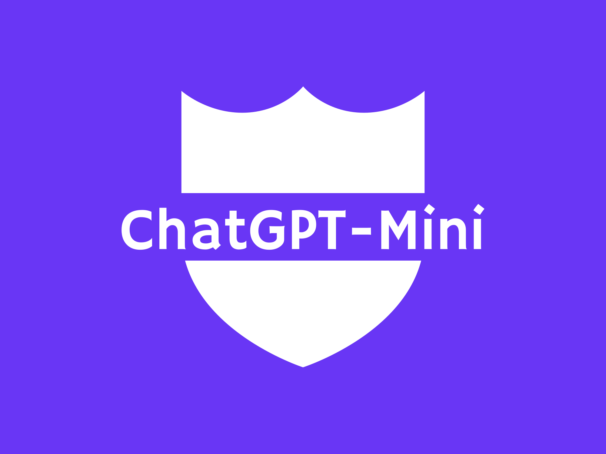

# ChatGPT Mini



🚀 Introducing ChatGPT Mini: A sleek command line interface for ChatGPT!

🤑 Save money with a cost-effective alternative to ChatGPT Plus!

🔒 Enjoy complete privacy for your conversations!

## Getting Started

### Prerequisites

To run this code, you will need to have the following libraries installed:

- openai
- rich

You will also need to have an OpenAI API key. You can sign up for an API key [here](https://beta.openai.com/signup/).

### Installation

1. Clone the repository to your local machine:

```bash
git clone https://github.com/<username>/chatgpt-mini.git
```

2. Install the required libraries:

```bash
pip install -r requirements.txt
```

3. Set your OpenAI API key as an environment variable:

```bash
export OPENAI_API_KEY=<your-api-key>
```

Alternatively, you can set your API key directly in the code by replacing the value of the `API_KEY` constant.

4. Run the code:

```bash
python chatgpt_mini.py
```

## Usage

When you run the code, you will be prompted to select a GPT model and provide a context for the chatbot. Once you have
provided this information, the chatbot will initialize and provide an initial message.

To interact with the chatbot, simply type a message and press Enter. The chatbot will generate a response based on the
input and provide it in the console. You can continue to converse with the chatbot by entering additional messages.

To exit the chat, type `exit` and press Enter. To clear the chat history and start a new conversation, type `clear` and
press Enter.

At the end of the chat, the total cost of the conversation will be displayed in a table.

## Screenshots


## License

&copy; 2023 by Adhish Thite. All rights reserved.

Made with ❤️ in India.
